# "Diary of a Wimpy Kid" RAG Chatbot

This project is a Retrieval-Augmented Generation (RAG) application that functions as a chatbot with expertise on the "Diary of a Wimpy Kid" book series. It uses a combination of LangChain, Milvus (a vector database), and a FastAPI server to provide answers to user questions. The user interface is powered by Open WebUI, which communicates with the backend via an OpenAI-compatible API.

## Table of Contents
- [Architecture](#architecture)
- [Project Structure](#project-structure)
- [Setup and Installation](#setup-and-installation)
- [Running the Application](#running-the-application)
- [Usage](#usage)
- [Testing](#testing)

## Architecture

The application is containerized using Docker and orchestrated with Docker Compose. The main components are:

1.  **`rag-api`**: A FastAPI server built with LangServe that exposes the RAG chain. It provides standard LangServe endpoints and an OpenAI-compatible API for the frontend.
2.  **`open-webui`**: A web-based chat interface that provides a user-friendly way to interact with the RAG chatbot. It is configured to use the `rag-api` as its backend model.
3.  **`milvus-standalone`**: A Milvus vector database instance used to store document embeddings for efficient similarity searches.

```mermaid
graph TD
    subgraph "User Interface"
        A[👤 User] --> B{Open WebUI};
    end

    subgraph "Backend Services (Docker Compose)"
        B -- "HTTP Request" --> C[rag-api / LangServe];
        C -- "Embed & Query" --> D[Milvus Vector DB];
        C -- "LLM Call" --> E[OpenAI API];
    end

    subgraph "Data Pipeline (on startup)"
        F[📄 PDF/Text Files] --> G[Document Loader];
        G --> H[Text Splitter];
        H --> I[OpenAI Embeddings];
        I --> D;
    end

    E -- "Response" --> C;
    C -- "Streamed Response" --> B;
```



## Project Structure

Here are the key files in this project:

-   `rag_app.py`: The core logic for the RAG pipeline. It handles document loading, text splitting, embedding creation, and the definition of the LangChain that generates answers.
-   `langserve_server.py`: The FastAPI server that wraps the RAG chain from `rag_app.py` and exposes it through API endpoints.
-   `docker-compose-langserve.yml`: The Docker Compose file that defines and configures all the services (`rag-api`, `open-webui`, `milvus-standalone`).
-   `requirements.txt`: A list of all the Python dependencies required for the project.
-   `data/` & `pdf/`: Directories containing the source documents (text files and PDFs) that the RAG system uses to build its knowledge base.
-   `test_rag.py`: An integration test script that directly tests the API endpoints of the `rag-api` server.
-   `test_openwebui.py`: An end-to-end test script using Playwright that simulates a user interacting with the web UI to verify the entire system is working.

## Setup and Installation

### Prerequisites
- Docker and Docker Compose
- Python 3.9+
- An OpenAI API key

### Steps
1.  **Clone the repository:**
    ```bash
    git clone <repository-url>
    cd <repository-directory>
    ```

2.  **Create an environment file:**
    Create a file named `.env` in the root of the project and add your OpenAI API key:
    ```env
    OPENAI_API_KEY="sk-..."
    ```

3.  **Install Python dependencies:**
    It is recommended to use a virtual environment.
    ```bash
    python3 -m venv venv
    source venv/bin/activate
    pip install -r requirements.txt
    ```
    *(Note: The application itself runs in Docker, but these dependencies are needed to run the local test scripts.)*

## Running the Application

To start all the services (RAG API, Open WebUI, and Milvus), run the following Docker Compose command:

```bash
docker-compose -f docker-compose-langserve.yml up --build
```

-   `--build`: This flag forces Docker to rebuild the `rag-api` image, which is crucial to ensure your latest code changes are included.

Once the services are running, you can access them at:
-   **Open WebUI**: [http://localhost:3000](http://localhost:3000)
-   **RAG API (Playground)**: [http://localhost:8001/wimpy-kid-rag/playground/](http://localhost:8001/wimpy-kid-rag/playground/)
-   **RAG API (Docs)**: [http://localhost:8001/docs](http://localhost:8001/docs)

## Usage

1.  **Open the Web UI**: Navigate to [http://localhost:3000](http://localhost:3000) in your browser.
2.  **Select the Model**:
    - If it's your first time, you may need to sign up for a local account.
    - In the chat interface, click on "Select a model" at the top.
    - Choose **`wimpy-kid-rag`** from the list.
3.  **Ask a Question**: Type a question about "Diary of a Wimpy Kid" into the chatbox and press enter. The chatbot will stream a response based on the documents it has processed.

## Testing

This project includes two types of tests to ensure its functionality.

### 1. API Integration Tests

This test script directly calls the API endpoints of the `rag-api` server to verify its behavior, including health checks, model availability, and streaming/non-streaming responses.

**To run the tests:**
```bash
python test_rag.py
```

### 2. End-to-End UI Tests

This test uses Playwright to launch a browser, navigate to the Open WebUI, send a message, and verify that the correct response appears in the chat window. It tests the full user flow.

**Prerequisites:**
You need to install the Playwright browser dependencies first:
```bash
playwright install
```

**To run the tests:**
```bash
pytest test_openwebui.py
```
*(Note: Ensure the Docker services are running before executing the tests.)*